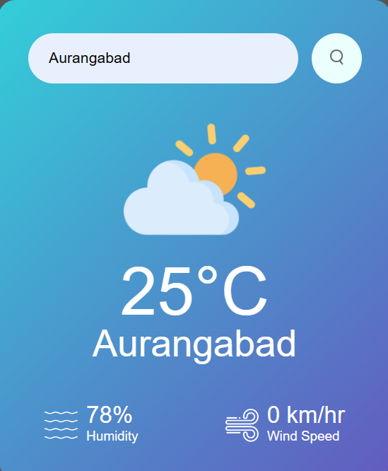

# Weather App

This is a simple Weather App developed using HTML, CSS, and JavaScript. It allows users to check the current weather conditions of any location around the world.

## Features

- **Current Weather:** Get real-time weather updates including temperature, humidity, wind speed, and weather condition.
- **Search:** Enter any location to view its current weather.
- **Responsive Design:** The app is responsive and works seamlessly on desktop and mobile devices.

## Technologies Used

-  HTML5
-  CSS3
-  JavaScript

## Installation

1. **Clone the repository:**
    ```sh
    git clone https://github.com/akankshabhayekar/Weather-App.git
    ```

2. **Navigate to the project directory:**
    ```sh
    cd Weather-App
    ```

3. **Open the `index.html` file in a web browser:**
    - Double-click the `index.html` file in your file explorer, or
    - Right-click the `index.html` file, select "Open with," and choose your preferred web browser.

## Usage

To use the Weather App, follow the installation instructions above, then enter the name of the location you want to check the weather for in the provided input field and press the "Search" button. 

- **When you enter a city name:** The app will display the current weather conditions for the specified location.
- **When you enter an incorrect city name:** The app will notify you about the incorrect input.

## Screenshots

**When you enter a city name:**



**When you enter an incorrect city name:**


## Credits

This Weather App was created by [Akanksha Bhayekar](https://github.com/akankshabhayekar) as part of a web development project.

## License

This project is licensed under the MIT License - see the [LICENSE](LICENSE) file for details.
